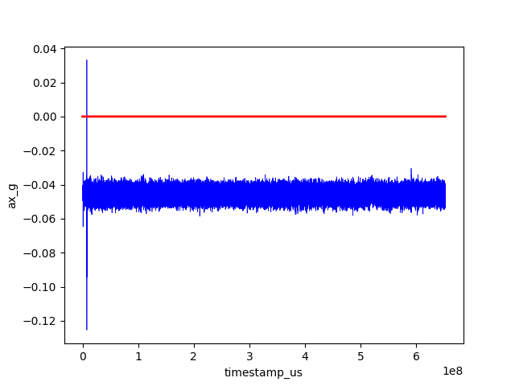
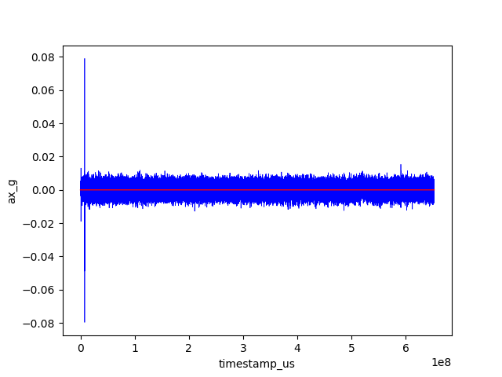
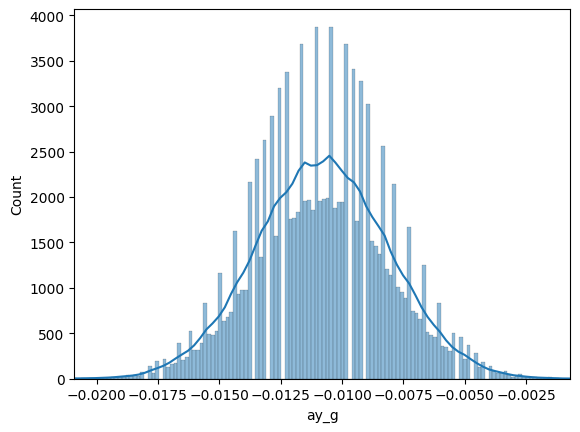
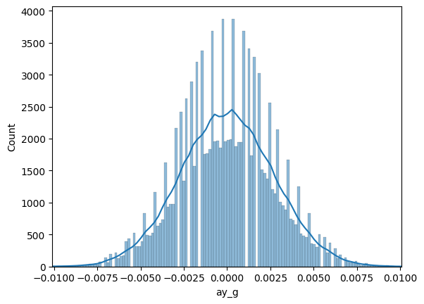
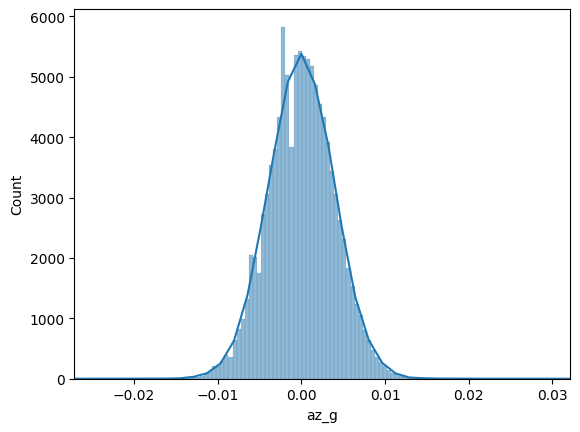
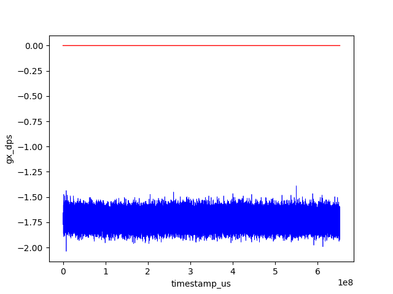
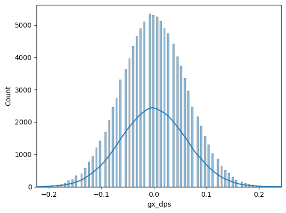
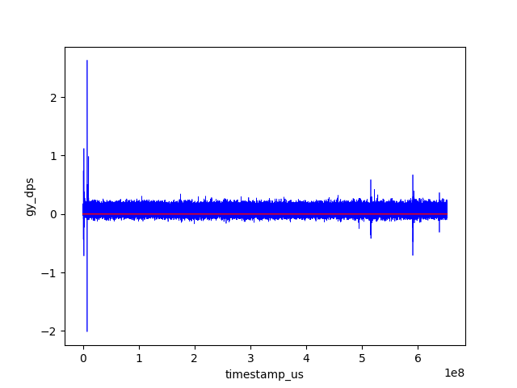
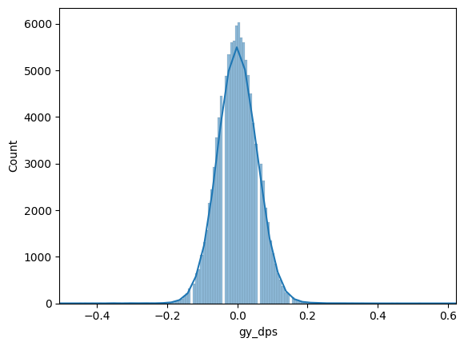
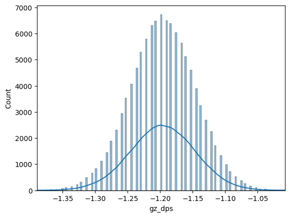

# ESP32 + MPU6050 — Inertial System Study

*🇧🇷 [Leia em Português](README.md)*

A study project for the MPU6050 inertial sensor with ESP32, aimed at understanding its operation and collecting data for future implementation in an **Inertial Navigation System (INS)**.

## Objective

Before integrating the MPU6050 into a real inertial system, this project investigates:

- Sensor behavior under controlled conditions (bias, noise, gyroscope drift)
- Maximum reliable sampling rate via I2C
- Data integrity in a producer/consumer architecture with FreeRTOS
- The complete pipeline: ESP32 reading → serial transmission → capture and storage on PC

## Project Structure

```
ESP-MPU6050/
├── mpu_6050/          # ESP32 Firmware (ESP-IDF)
│   └── main/
│       └── i2c_basic_example_main.c
└── serial-read/       # Python serial capture script
    ├── main.py
    └── requirements.txt
```

## About the MPU6050

The MPU6050 is a 6 DoF IMU (Inertial Measurement Unit) manufactured by InvenSense, combining:

- **Triaxial accelerometer** — configurable full scale (±2 / ±4 / ±8 / ±16 g)
- **Triaxial gyroscope** — configurable full scale (±250 / ±500 / ±1000 / ±2000 °/s)
- **Internal temperature sensor**
- **I2C** interface (up to 400 kHz) or SPI
- **DMP** (Digital Motion Processor) for hardware-based sensor fusion

In this project, the MPU6050 is configured as follows:

| Parameter | Value |
|-----------|-------|
| Sampling rate | **200 Hz** |
| Low-pass filter (DLPF) | 188 Hz BW |
| Accel full scale | ±2 g (16 384 LSB/g) |
| Gyro full scale | ±250 °/s (131 LSB/°/s) |

## System Architecture

```
┌─────────────────────────────────────┐        ┌──────────────────────┐
│              ESP32                  │  UART  │         PC           │
│                                     │ ──────>│                      │
│  Core 0          Core 1             │        │  serial-read/main.py │
│  ┌──────────┐   ┌───────────────┐  │        │                      │
│  │ Producer │   │   Consumer    │  │        │  ┌────────────────┐  │
│  │ 200 Hz   │──>│ CSV via UART0 │  │        │  │dados_mpu6050   │  │
│  │(esp_timer│   │               │  │        │  │    .csv        │  │
│  │+ I2C)    │   │               │  │        │  └────────────────┘  │
│  └──────────┘   └───────────────┘  │        └──────────────────────┘
│         ↑                           │
│   ┌─────────┐                       │
│   │ MPU6050 │ (I2C)                 │
│   └─────────┘                       │
└─────────────────────────────────────┘
```

- **Core 0** reads the MPU6050 every 5 ms (200 Hz), triggered by `esp_timer`, and pushes each sample into a FreeRTOS queue.
- **Core 1** consumes the queue and transmits the data as CSV over UART0 (USB-Serial).
- The Python script on the PC receives the serial data, filters logs, and saves everything to `.csv`.

## Collected Data Format

```
timestamp_us,ax_g,ay_g,az_g,gx_dps,gy_dps,gz_dps,temp_c,dropped
428312,0.0012,-0.0034,1.0021,0.0153,-0.0076,0.0023,28.45,0
433318,0.0011,-0.0035,1.0019,0.0153,-0.0076,0.0023,28.45,0
```

| Field | Unit | Description |
|-------|------|-------------|
| `timestamp_us` | µs | Time since boot (`esp_timer_get_time()`) |
| `ax_g` / `ay_g` / `az_g` | g | Acceleration on X, Y, Z axes |
| `gx_dps` / `gy_dps` / `gz_dps` | °/s | Angular velocity on X, Y, Z axes |
| `temp_c` | °C | Sensor internal temperature |
| `dropped` | — | Dropped samples (queue full) |

## How to Use

### 1. Firmware (ESP32)

```bash
cd mpu_6050
idf.py -p /dev/ttyUSB0 flash monitor
```

See [mpu_6050/README_en.md](mpu_6050/README_en.md) for pin configuration and menuconfig details.

### 2. Serial Capture (PC)

```bash
cd serial-read
python -m venv .venv
source .venv/bin/activate
pip install -r requirements.txt
python main.py
```

See [serial-read/README_en.md](serial-read/README_en.md) to adjust serial port and output file.

## Hardware Connection

| ESP32 | MPU6050 |
|-------|---------|
| SDA (configurable via menuconfig) | SDA |
| SCL (configurable via menuconfig) | SCL |
| 3.3 V | VCC |
| GND | GND |

> External pull-ups are not required — the driver enables the ESP32 internal pull-ups.

## MPU6050 Error Bias Characterization in Static State

### Mean

|AcX|AcY|AcZ|
|---|---|---|
|-0.04574351853562127|-0.010799607491826594 |-0.03767737582888491|  

|GyrX|GyrY|GyrZ|
|----|----|----|
|-1.7234902704150432|0.06561444337723268|-1.196246905188496|

### Standard Deviation

|AcX|AcY|AcZ|
|---|---|---|
|0.0030293403270227038|0.0027005578449914827|0.004056420969595663|   

|GyrX|GyrY|GyrZ|
|----|----|----|
|0.062477260640924945|0.05919906720942323|0.05011258233701453|

### Applying Correction Based on Mean Values

|Without correction factor| With correction factor |
|---------------------|-----------------------|
|||
|||
|||
|||
|||
|||

## Next Steps (towards INS)

- [ ] Characterize accelerometer and gyroscope **bias** and **noise** in static conditions
- [ ] Estimate **gyroscope drift** over time
- [ ] Implement **calibration** (zero-rate offset and sensitivity)
- [ ] Apply **complementary filter** or **Kalman filter** for Accel+Gyro fusion
- [ ] Integrate accelerations for velocity and position estimation (dead reckoning)
- [ ] Evaluate using the MPU6050 internal **DMP** for real-time quaternions
